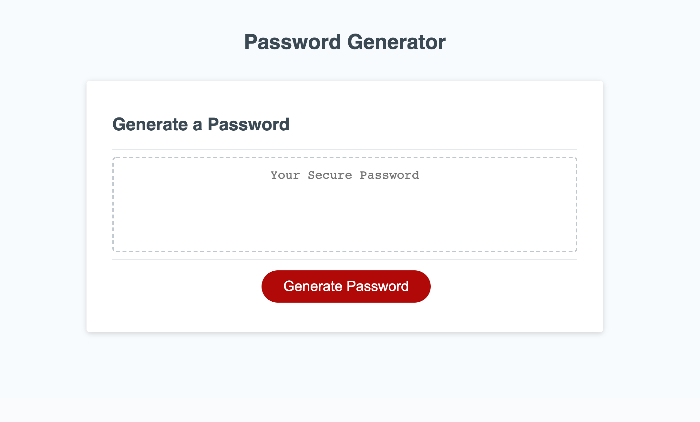
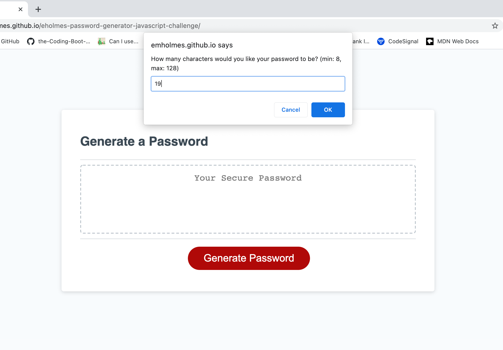
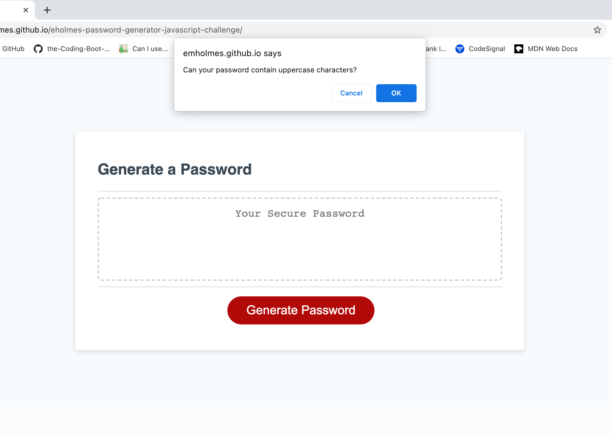
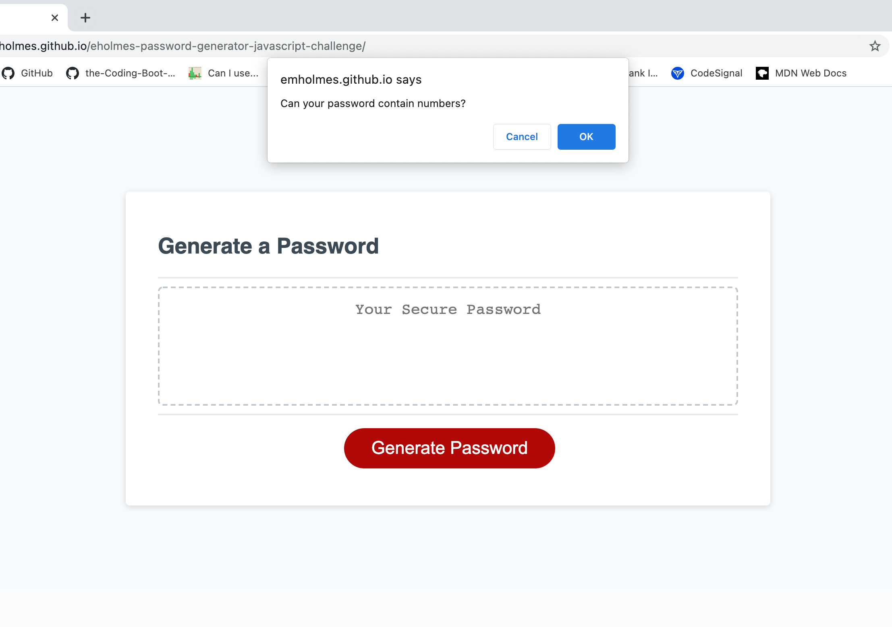
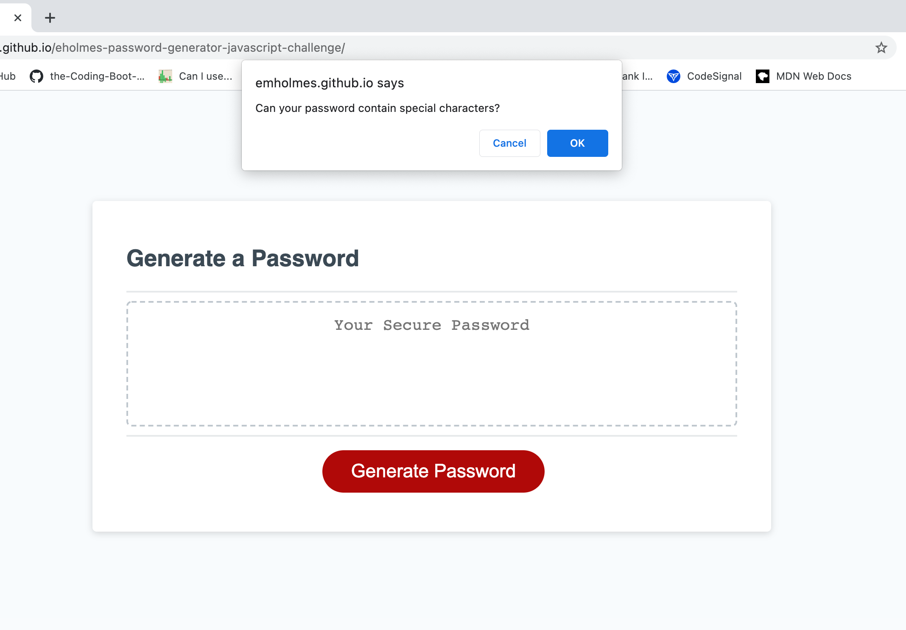
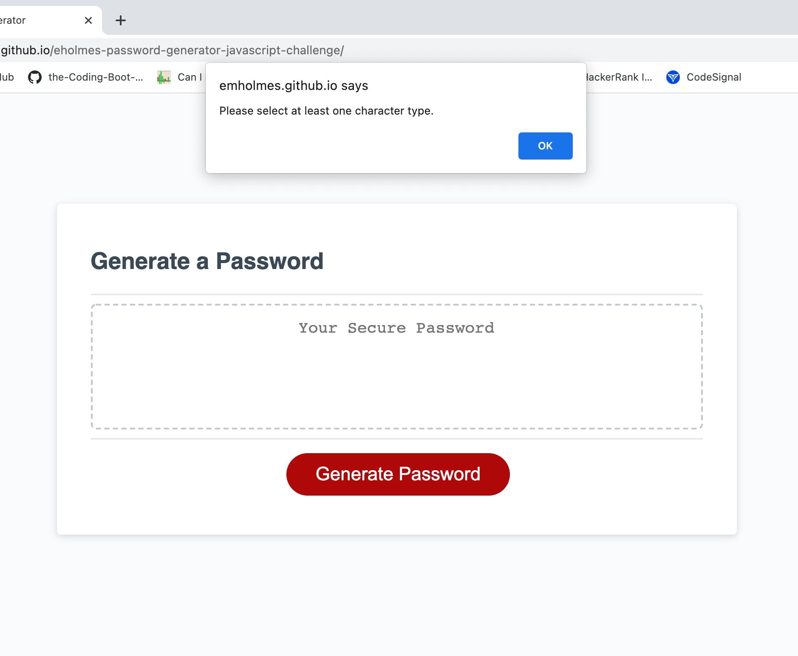
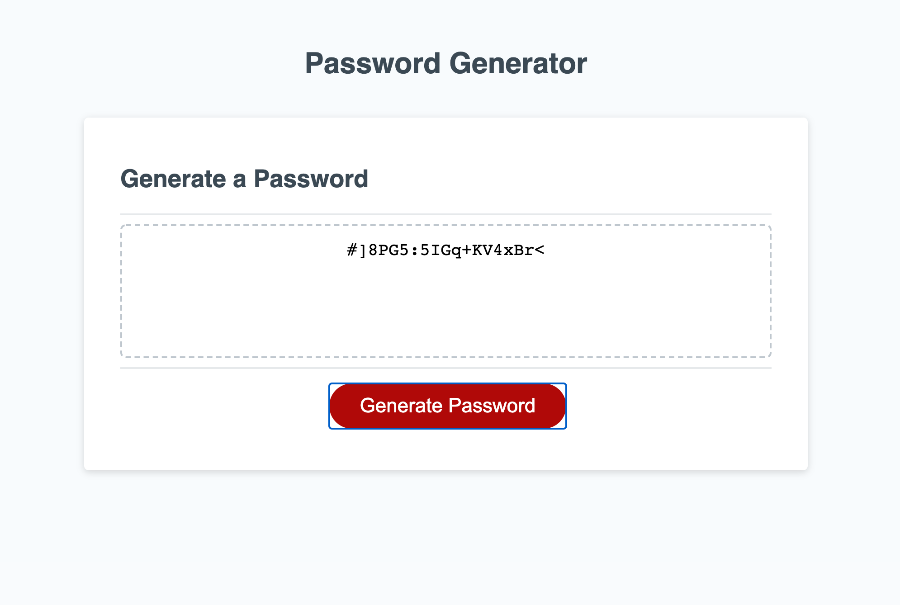

# Javascript Challenge: Password Generator

This repository contains the code for a password generator. It will generate a random password based on user specified criteria. 

Clicking the "Generate Password" button, will prompt the user with the following questions: 
1. How many characters would you like your password to be? 
 This number must be between 8 and 128, inclusive. 
2. Can your password contain lowercase characters?
3. Can your password contain uppercase characters?
4. Can your password contain numeric characters?
5. Can your password contain special characters?

** You must select at least one character type to generate a password.

The generatePassword function will randomly select one of each allowed character and push each into an array. The remaining characters are randomly selected and pushed into the array as well.  
After all characters are selected, the array will be shuffled and displayed on the screen as a string. 

Use this password generator to create as many passwords as you need. This password generator does not save previously generated passwords. 

View the Password Generator here: https://emholmes.github.io/eholmes-password-generator-javascript-challenge/ (deployed application)

